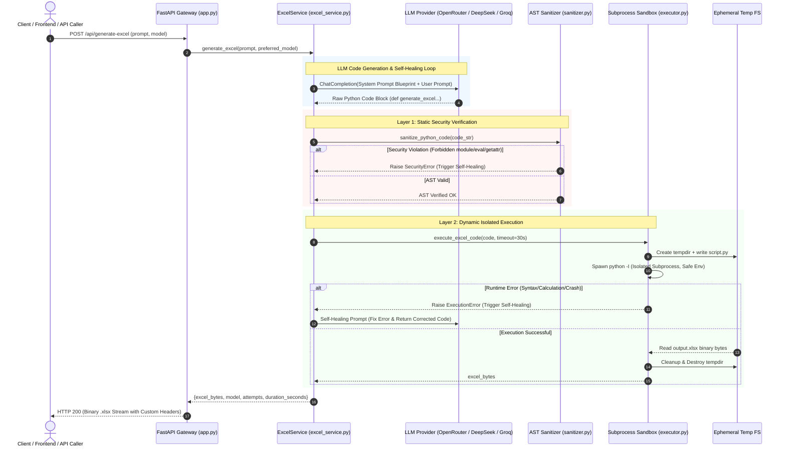

# 🏗️ AI Excel Generator — System Architecture & Technical Specification

An enterprise-grade, microservice architecture that transforms unstructured natural language prompts into executive-ready, highly styled, formula-driven Excel workbooks (`.xlsx`) using LLM code generation, AST-level static security analysis, and isolated subprocess sandboxing.

---

## 📑 Table of Contents
1. [System Overview](#1-system-overview)
2. [End-to-End Architecture Diagram](#2-end-to-end-architecture-diagram)
3. [Core Subsystems & Component Breakdown](#3-core-subsystems--component-breakdown)
   - [A. API Gateway & Routing (FastAPI)](#a-api-gateway--routing-fastapi)
   - [B. LLM Orchestration & Self-Healing Loop](#b-llm-orchestration--self-healing-loop)
   - [C. AST Security Sanitizer (Static Analysis)](#c-ast-security-sanitizer-static-analysis)
   - [D. Isolated Subprocess Sandbox (Dynamic Execution)](#d-isolated-subprocess-sandbox-dynamic-execution)
   - [E. Corporate Design System & Prompt Blueprint](#e-corporate-design-system--prompt-blueprint)
4. [Security & Zero-Trust Execution Model](#4-security--zero-trust-execution-model)
5. [AWS Cloud Infrastructure & Deployment](#5-aws-cloud-infrastructure--deployment)
6. [Performance & Scalability Characteristics](#6-performance--scalability-characteristics)

---

## 1. System Overview

Traditional AI document systems try to output raw data (CSV/JSON/cells), which hits severe LLM token limits and produces unstyled, static sheets.

This system uses a **Code-as-an-Intermediary Architecture**:
1. The user provides a high-level natural language prompt.
2. The LLM acts as a **Python Data Engineer**, generating deterministic, programmatic Python code (`openpyxl` / `pandas`).
3. The code undergoes **Static AST Inspection** to eliminate any Remote Code Execution (RCE) vectors.
4. The code is executed in an **Ephemeral Isolated Subprocess Sandbox** with strict timeouts and memory boundaries.
5. The generated binary `.xlsx` is streamed back to the client.

```
[ User Prompt ] ──► [ LLM Code Gen ] ──► [ AST Sanitizer ] ──► [ Sandbox Exec ] ──► [ .xlsx Stream ]
```

---

## 2. End-to-End Architecture Diagram



---

## 3. Core Subsystems & Component Breakdown

### A. API Gateway & Routing (`app.py`)
* Built with **FastAPI** and **Uvicorn ASGI**.
* **Key Endpoints:**
  * `GET /health`: Microservice health check reporting active AI provider, base URL, and sandbox status.
  * `GET /`: Serves the responsive web testing interface.
  * `POST /api/generate-excel`: Full end-to-end generation streaming binary `.xlsx` directly with `Content-Disposition` attachment headers.
  * `POST /api/generate-excel/preview`: Returns generated Python code and metadata without downloading binary.
  * `POST /api/execute-code`: Direct sandbox execution for verified Python scripts.

---

### B. LLM Orchestration & Self-Healing Loop (`services/excel_service.py`)
* **Multi-Provider Resilience:** Connects dynamically to **OpenRouter**, **DeepSeek**, **Groq**, or any OpenAI-compatible API gateway.
* **Automated Self-Healing Loop:**
  * If the AST Sanitizer or Python Sandbox raises an error, the engine captures the stack trace and feeds it into the `SELF_HEALING_PROMPT_TEMPLATE`.
  * The LLM fixes its own syntax/logic error in real-time (up to `max_retries=2`) without failing the user's request.
* **Fallback Cascade:** Automatically falls back across secondary and tertiary candidate models if rate limits (`429`) or model outages occur.

---

### C. AST Security Sanitizer (`core/sanitizer.py`)
Before any generated Python code touches the execution engine, it is parsed into an **Abstract Syntax Tree (AST)** and traversed via `ast.NodeVisitor`:

* **Module Whitelisting:** Only safe data manipulation packages are permitted:
  * Allowed: `openpyxl`, `xlsxwriter`, `pandas`, `numpy`, `datetime`, `math`, `random`, `decimal`, `itertools`, `collections`, `re`, `json`, `string`.
  * Forbidden: `os`, `sys`, `subprocess`, `socket`, `requests`, `urllib`, `shutil`, `pty`, `ctypes`, etc.
* **Built-in Function Ban:** Disallows `eval()`, `exec()`, `compile()`, `open()`, `input()`, `globals()`, `locals()`, `vars()`, `__import__()`.
* **Dunder & Reflection Protection:** Blocks access to runtime introspection like `__subclasses__`, `__bases__`, `__globals__`, `__code__`, and `__builtins__`.
* **Contract Enforcement:** Verifies that the required entry point `def generate_excel(output_path: str):` exists.

---

### D. Isolated Subprocess Sandbox (`core/executor.py`)
* **Subprocess Isolation:** Runs the sanitized Python code via `python -I` (Isolated mode, ignoring user environment and site-packages tampering).
* **Ephemeral Temp Directories:** Executes inside a fresh `tempfile.TemporaryDirectory()`, which is destroyed immediately after binary extraction.
* **Environment Scrubbing:** Strips all API keys (`OPENAI_API_KEY`, `DEEPSEEK_API_KEY`, AWS credentials) from the subprocess environment so the generated script cannot inspect secrets.
* **Hard Timeouts:** Enforces execution timeouts (e.g., 30s) to prevent infinite loops (`while True`).

---

### E. Corporate Design System & Prompt Blueprint (`core/prompts.py`)
Standardizes all generated workbooks into C-suite ready executive spreadsheets:

1. **Header & Metadata Banner (Rows 1–3):**
   * 16pt Bold Navy (`#0F172A`) title with 9pt muted italic metadata subtitle.
2. **Executive KPI Cards (Rows 5–7):**
   * 3 to 4 side-by-side metric cards featuring light ice-blue fill (`#F1F5F9`), thin borders, bold primary metrics (`16pt`), and delta indicators.
3. **Structured Data Table (Rows 9+):**
   * Deep Navy headers (`#0F172A`) with bold white text.
   * Alternating zebra striping (`#F8FAFC` vs `#FFFFFF`).
   * Strict number formatting: Currency `\"$\"#,##0`, Percentage `0.0%`, Dates `YYYY-MM-DD`.
   * Accounting Total row with top thin border and bottom double border.
4. **Native Dynamic Formulas:**
   * Utilizes `=SUM(...)`, `=AVERAGE(...)`, `=IF(...)`, `=SUMIFS(...)` instead of hardcoded numbers.
5. **Embedded Visualizations:**
   * Automatically embeds native `openpyxl.chart` (Bar, Line, Donut) matching the corporate palette.

---

## 4. Security & Zero-Trust Execution Model

```
┌────────────────────────────────────────────────────────┐
│               INCOMING GENERATED CODE                  │
└───────────────────────────┬────────────────────────────┘
                            │
                            ▼
           [ 1. AST Static Security Inspection ]
           - Blocks unauthorized imports (os, sys, etc.)
           - Blocks dangerous built-ins (eval, exec)
           - Blocks dunder / reflection traversal
                            │
                       (PASSES)
                            │
                            ▼
           [ 2. Environment Scrubbing ]
           - Strips API keys & system tokens
           - Sets safe minimal PATH and temp directory
                            │
                            ▼
           [ 3. Isolated Subprocess Sandbox ]
           - Executes with `python -I`
           - 30-second hard execution timeout
           - Ephemeral scratch filesystem
                            │
                            ▼
               [ Clean .xlsx Binary Stream ]
```

---

## 5. AWS Cloud Infrastructure & Deployment

The service is fully automated and deployed to **AWS ECS Fargate** behind an **Application Load Balancer (ALB)**:

| AWS Resource | Name / Configuration | Purpose |
| :--- | :--- | :--- |
| **Amazon ECR** | `excel-generator-api` | Private Docker container registry |
| **ECS Cluster** | `excel-generator-cluster` | Serverless container orchestration (Fargate) |
| **ECS Task Def** | `excel-generator-task` | 1 vCPU, 2GB RAM, Port 8001 |
| **Load Balancer**| `excel-generator-alb` | Public HTTP traffic entry point with 300s timeout |
| **Target Group** | `excel-generator-tg` | Health check target routing to `/health` on port 8001 |
| **CloudWatch**   | `/ecs/excel-generator-task` | Centralized real-time logging stream |
| **CI/CD**        | `.github/workflows/deploy.yml`| Automated zero-downtime rolling deploys on push |

### 🔒 Secret Isolation:
* **Zero Secrets in Git:** `.env` is untracked and excluded.
* **Zero Secrets in Docker Images:** `.dockerignore` blocks `.env` and local caches.
* **AWS Runtime Injection:** API keys (`OPENAI_API_KEY`, `OPENAI_BASE_URL`) are injected exclusively into the ECS Task Definition in AWS.

---

## 6. Performance & Scalability Characteristics

* **Sub-Second Generation for Thousands of Rows:** Because data generation is programmatic (Python loops/comprehensions) rather than token-by-token LLM text completion, creating **1,000 to 50,000 realistic rows** executes in **< 0.2 seconds** in the sandbox.
* **Predictable Latency:** Average LLM code generation takes **8–25 seconds**, sandbox execution takes **0.05–0.5 seconds**, and binary streaming is near-instantaneous.
* **Stateless & Scalable:** The service is 100% stateless; each request executes in an isolated ephemeral directory, allowing horizontal auto-scaling on ECS Fargate without state conflicts.
